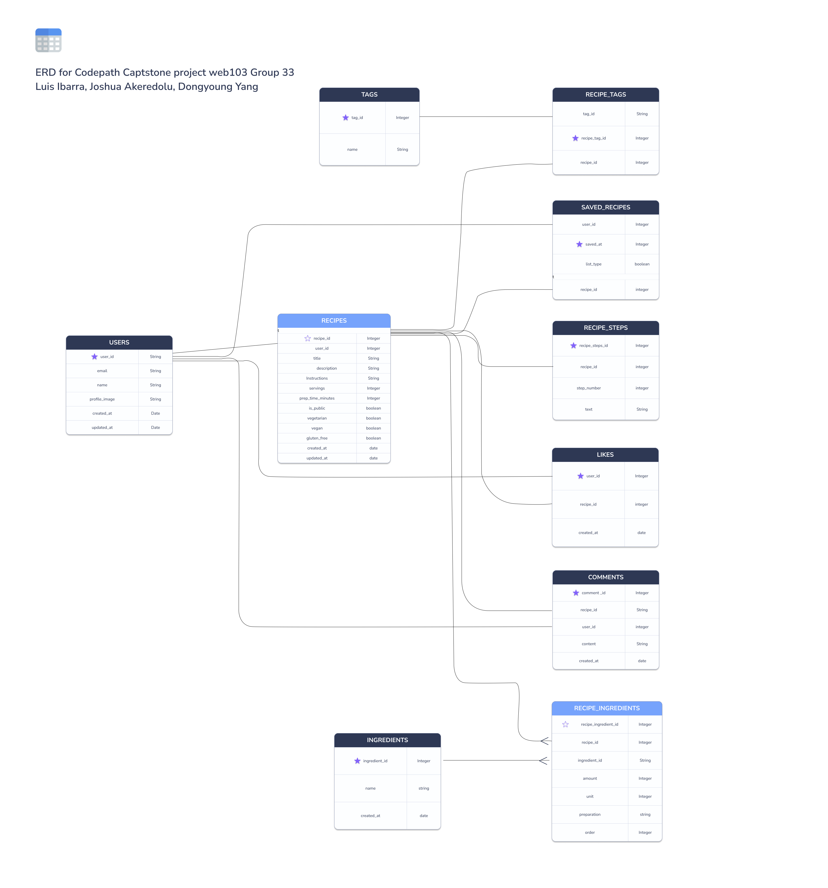

# Entity Relationship Diagram

Reference the Creating an Entity Relationship Diagram final project guide in the course portal for more information about how to complete this deliverable.

## Create the List of Tables

[
users
recipes
ingredients
recipe_ingredients
tags
recipe_tags
saved_recipes
likes
comments
recipe_steps
]

## Add the Entity Relationship Diagram

[👉🏾👉🏾👉🏾 Include an image or images of the diagram below. You may also wish to use the following markdown syntax to outline each table, as per your preference.]

### tables

#### users

| Column Name | Type      | Description                  |
| ----------- | --------- | ---------------------------- |
| id          | integer   | primary key                  |
| username    | text      | user's display or login name |
| email       | text      | user's email authentication  |
| created_at  | timestamp | record creation time         |
| updated_at  | timestamp | record last update time      |

#### recipes

| Column Name | Type      | Description                        |
| ----------- | --------- | ---------------------------------- |
| id          | integer   | primary key                        |
| user_id     | integer   | foreign key -> `users.id` (author) |
| title       | text      | recipe title                       |
| description | text      | recipe description / summary       |
| servings    | integer   | number of servings                 |
| prep_time   | integer   | preparation time (minutes)         |
| cook_time   | integer   | cooking time (minutes)             |
| image_url   | text      | optional image URL                 |
| created_at  | timestamp | record creation time               |
| updated_at  | timestamp | record last update time            |

#### ingredients

| Column Name | Type      | Description                 |
| ----------- | --------- | --------------------------- |
| id          | integer   | primary key                 |
| name        | text      | ingredient name             |
| created_at  | timestamp | record creation time (opt.) |
| updated_at  | timestamp | record update time (opt.)   |

#### recipe_ingredients

| Column Name   | Type    | Description                          |
| ------------- | ------- | ------------------------------------ |
| id            | integer | primary key                          |
| recipe_id     | integer | foreign key -> `recipes.id`          |
| ingredient_id | integer | foreign key -> `ingredients.id`      |
| quantity      | numeric | amount (e.g., 1.5)                   |
| unit          | text    | measurement unit (e.g., cup, tsp)    |
| preparation   | text    | optional notes or preparation detail |
| order         | numeric | optional order of ingredient         |

#### tags

| Column Name | Type    | Description                   |
| ----------- | ------- | ----------------------------- |
| id          | integer | primary key                   |
| name        | text    | tag name (e.g., "vegetarian") |

#### recipe_tags

| Column Name | Type    | Description                 |
| ----------- | ------- | --------------------------- |
| id          | integer | primary key                 |
| recipe_id   | integer | foreign key -> `recipes.id` |
| tag_id      | integer | foreign key -> `tags.id`    |

#### saved_recipes

| Column Name | Type      | Description                 |
| ----------- | --------- | --------------------------- |
| id          | integer   | primary key                 |
| user_id     | integer   | foreign key -> `users.id`   |
| recipe_id   | integer   | foreign key -> `recipes.id` |
| created_at  | timestamp | when the recipe was saved   |

#### likes

| Column Name | Type      | Description                 |
| ----------- | --------- | --------------------------- |
| id          | integer   | primary key                 |
| user_id     | integer   | foreign key -> `users.id`   |
| recipe_id   | integer   | foreign key -> `recipes.id` |
| created_at  | timestamp | when the like was recorded  |

#### comments

| Column Name | Type      | Description                  |
| ----------- | --------- | ---------------------------- |
| id          | integer   | primary key                  |
| user_id     | integer   | foreign key -> `users.id`    |
| recipe_id   | integer   | foreign key -> `recipes.id`  |
| content     | text      | comment content              |
| created_at  | timestamp | when the comment was created |

#### recipe_steps

| Column Name | Type      | Description                 |
| ----------- | --------- | --------------------------- |
| id          | integer   | primary key                 |
| recipe_id   | integer   | foreign key -> `recipes.id` |
| step_number | integer   | order of the step           |
| instruction | text      | step instruction            |
| created_at  | timestamp | optional timestamp          |
