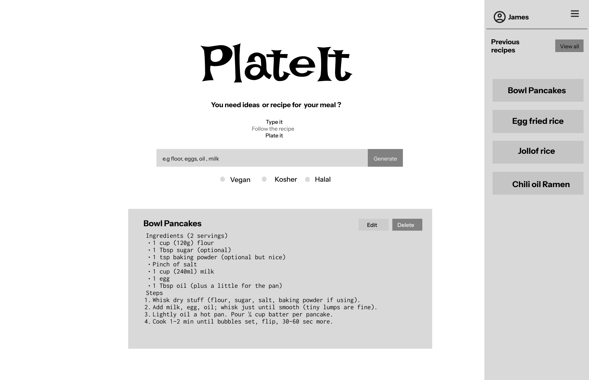
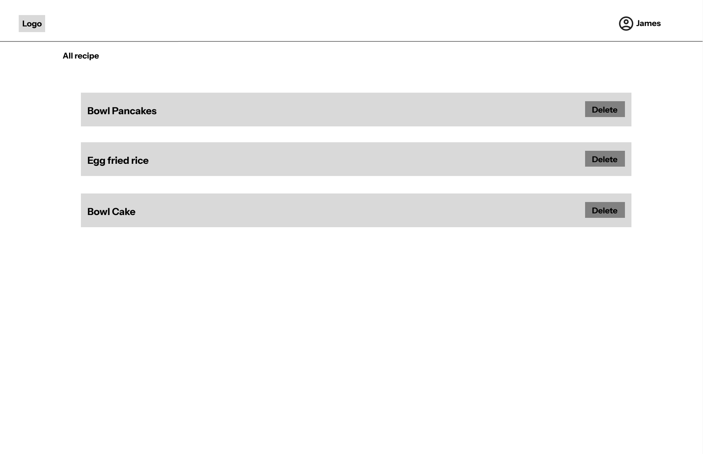
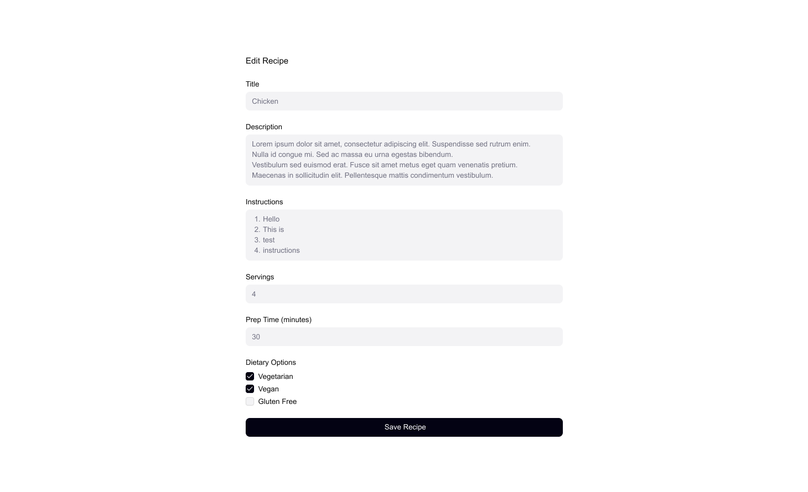
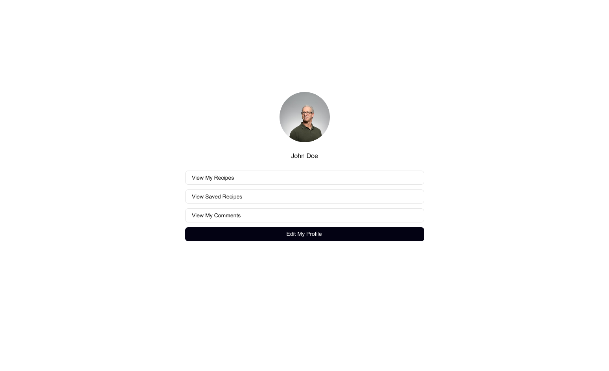

# Wireframes

Reference the Creating an Entity Relationship Diagram final project guide in the course portal for more information about how to complete this deliverable.

## List of Pages

[👉🏾👉🏾👉🏾 List the pages you expect to have in your app, with a ⭐ next to pages you have wireframed
- [ ] ⭐ Home Page
- [ ] Login / Register Page
- [ ] ⭐ All Recipes Page
- [ ] Recipe Detail Page
- [ ] Create Recipe Page
- [ ] ⭐ Edit Recipe Page
- [ ] ⭐ Profile Page
- [ ] Saved Recipes Page
]

## Wireframe 1: [Home page]

## Wireframe 2: [All Recipes Page]

## Wireframe 3: [Edit Recipe Page]

## Wireframe 4: [Profile Page]

